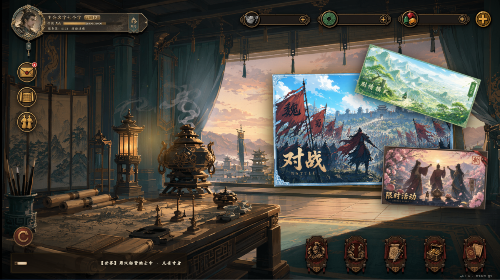
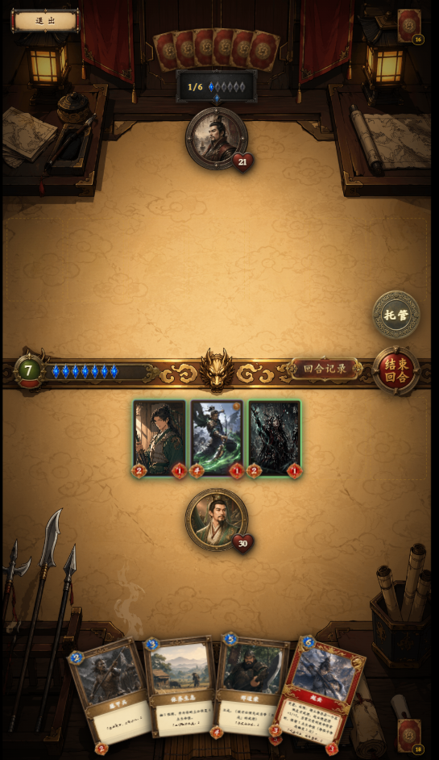
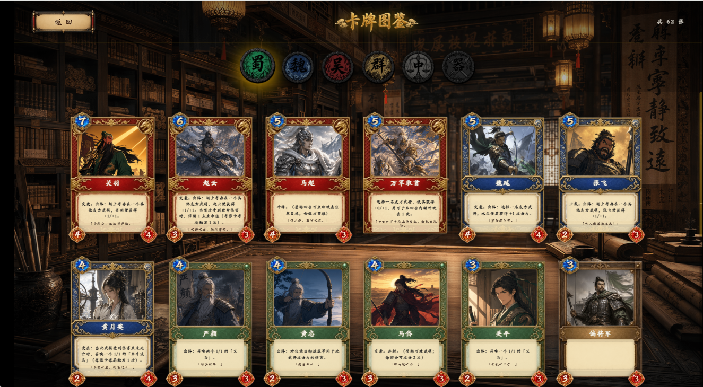
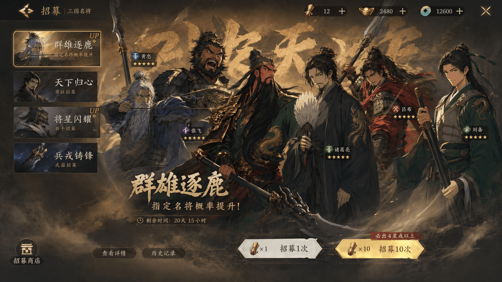
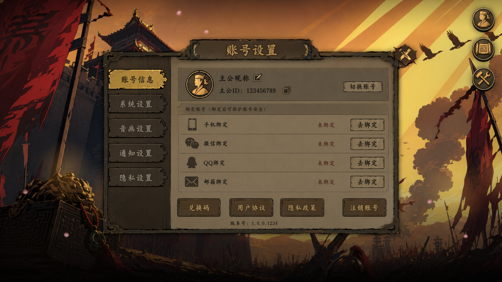
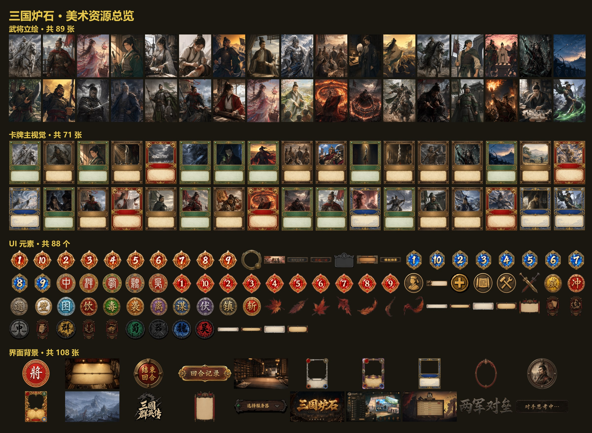

# 三国炉石（Three Kingdoms Hearthstone）· Demo

<p align="center">
  <a href="https://zlllllll395487.github.io/ThreeKingdoms-Hearthstone-Demo/"></a>
  
  
  
  
  
</p>

> 以三国为题材、炉石传说为玩法骨架的卡牌对战游戏 Web 端 Demo。
> 一套确定性引擎在前端、在线后端与模拟框架三处复用，内置 AI 对战模拟驱动数值平衡，至 iter6.1 阵营胜率差收敛至 5.6%。

**▶ [在线试玩](https://zlllllll395487.github.io/ThreeKingdoms-Hearthstone-Demo/)**　｜　**📖 [游戏设计文档](docs/GAME-DESIGN.md)**　｜　**🎨 [美术设计稿（Figma）](https://www.figma.com/design/PaOOfR1UKY8J77vBD09MFf/%E4%B8%89%E5%9B%BD%E7%82%89%E7%9F%B3?node-id=163-4)**

---

## ✨ 亮点

- **确定性游戏引擎** — 纯 TypeScript 同步状态机，零浏览器与框架依赖；前端、在线后端、模拟框架三处复用同一份规则代码，从根本上规避「服务端与客户端规则不一致」这一多人游戏常见缺陷。
- **数据驱动的数值平衡** — 内置 AI 对战模拟框架，1000 局约 1.5 秒，经 6 轮迭代将阵营胜率差由 65.3% 收敛至 5.6%，并提供全卡胜率报告与一键模拟工具。
- **权威服务器在线对战** — 服务器复用同一引擎担任裁判，个性化脱敏与视角翻转使前端战斗界面零改动即可支持真人联机。

---

## 在线体验

仓库公开后 GitHub Actions 自动部署至：

**https://zlllllll395487.github.io/ThreeKingdoms-Hearthstone-Demo/**

启动流程：splash「进入游戏」→ loading → 主菜单 →「对战」→ 选阵营 + 难度 → 教程（可跳过）→ 战斗。

## 界面预览

| 主菜单 | 战斗 | 卡牌图鉴 |
|:-:|:-:|:-:|
|  |  |  |

更多截图与阵营选择屏见 [docs/screenshots/](docs/screenshots/)。

## 美术与设计稿（Figma）

全部界面、卡牌与立绘的设计源文件托管于 Figma，可在线浏览：

**[三国炉石 · Figma 设计稿](https://www.figma.com/design/PaOOfR1UKY8J77vBD09MFf/%E4%B8%89%E5%9B%BD%E7%82%89%E7%9F%B3?node-id=163-4)**

> Figma 为设计源头，仓库内 `game/src/assets/` 下的 PNG / WebP 为其导出物。

部分界面 UI 设计：

| 招募 | 账号 |
|:-:|:-:|
|  |  |

整套美术资源总览（武将立绘 89 · 卡牌主视觉 71 · UI 元素 88 · 界面背景 108）：



## 仓库结构

| 目录 | 用途 |
|:--|:--|
| `docs/` | 设计文档（玩法策划、卡牌设计、实施方案、美术清单、审计报告、模拟报告） |
| `game/` | React 应用主体，含 `src/assets/` 游戏实际引用的全部成品资源（详见 `game/README.md`） |
| `.github/workflows/` | GitHub Actions 配置（GitHub Pages 自动部署） |
| `remove_background.py` | 图像背景去除辅助脚本 |

> **关于美术源文件**：原始美术工作素材（`asset/`）、历史替换存档（`assetofsanguo/`）与发布构建产物（`release/`）体量较大（合计逾 1 GB），仅保留于本地、未纳入版本库，以保持仓库轻量。游戏运行所需的成品资源均已就位于 `game/src/assets/`，克隆本仓库即可完整构建运行。

## 快速开始

```bash
cd d:/三国炉石/game
npm install            # 首次或克隆后安装依赖
npm run dev            # 启动开发服务器，默认监听 http://localhost:5173/
npm run build          # 生产构建至 game/dist/
npx tsc --noEmit       # TypeScript 静态检查，要求 0 错误
```

## 接手指引

新协作者或新对话接手时，建议按以下顺序阅读：

1. [docs/GAME-DESIGN.md](docs/GAME-DESIGN.md) — **游戏设计文档**，作品的统一设计视图（设计入口）
2. [HANDOFF.md](HANDOFF.md) — 接手手册，含目录结构、约束、待办与协作惯例
3. [game/PROGRESS.md](game/PROGRESS.md) — 项目进度档案，按阶段记录已完成与待办项
4. [docs/ASSET-INVENTORY.md](docs/ASSET-INVENTORY.md) — 资产清单（成品资源与源材料分层、命名规范）

更多分项设计文档位于 `docs/`，按编号顺序阅读。

## 技术栈

| 类别 | 选型 | 版本 |
|:--|:--|:--|
| 框架 | React | ^19.2 |
| 语言 | TypeScript | ~6.0 |
| 构建工具 | Vite | ^8.0 |
| 状态管理 | Zustand | ^5.0 |
| 样式 | Tailwind CSS + CSS Modules | ^4.3 |
| 动画 | Framer Motion | ^12.39 |
| 字体 | Google Fonts：Ma Shan Zheng / ZCOOL XiaoWei / Long Cang / Noto Serif SC | — |
| 资源加载 | Vite `import.meta.glob` | — |

## 设计规格

- **设计画布**：横屏 1920×1080 与竖屏 1080×1920 双尺寸切换，浏览器自适应等比缩放，超出部分以黑色 letterbox 填充
- **启动流程**：intro 视频（可跳过）→ splash 进入游戏 → loading 加载 → mainmenu 主菜单
- **状态机**：`src/store/uiStore.ts` 中 `currentScreen` 字段决定当前渲染的屏幕组件
- **画布切换**：Battle 与 Tutorial 屏使用竖屏 1080×1920（手游 portrait 体验），其余屏幕使用横屏 1920×1080
- **卡牌组件**：`src/components/Card/Card.tsx` 按稀有度加载对应边框 PNG，立绘、数值球、名字横幅、关键词印章采用模块化层叠渲染

## 项目阶段

| 阶段 | 内容 | 状态 |
|:--|:--|:-:|
| W1 视觉打磨 | 6 屏全部接入真实美术资源 | Done |
| W2 战场逻辑（含 §19 全部子项） | 完整对战体验落地，含 §19.6 反馈系统与 §19.7 验收期改动 | Done |
| §22 数值平衡 iter6.1 | AI 对战模拟驱动，阵营差由 baseline 的 65.3% 收敛至 5.6% | Done |
| §22-iter7 吴方 AoE 二轮微调 | 吕蒙新增 anchor_ramp / 火油机制改造 / 火烧赤壁等 4 张 AoE 调整 | Done（待玩家体验验收） |
| §23 AI 难度系统 | 生手 / 标准 / 宗师三档，本地存储记忆 | Done |
| §24 战斗内自动托管 | 战斗中一键切换 AI 自动决策 | Done |
| §25 教程屏 | 竖屏 1080×1920 教程页 | Done |
| §26 资源预加载（首版） | 主菜单核心资源预加载 | Done |
| §27 自定义鼠标光标 | 长枪 PNG 光标 + hover 金色光晕 + 点击波纹 | Done |
| §28 commit 历史规范化 | 历史 commit 按 Conventional Commits 重写 | Done |
| §29 分屏渐进预加载 | Loading 屏重做，按目标屏阻塞加载所需资源 + 30 条 Tip 文案池 + 4 张随机背景 | Done |
| §30 立绘与 Loading 背景 WebP 化 | 89 张立绘 + 4 张背景转 WebP，体积砍 76%，cardvisual 保留 PNG | Done |
| GitHub Pages 自动部署 | workflow 已就绪 | Done |
| W5 体验层面打磨 | 战斗细节动效 / 音效系统 / 卡牌交互手感 | Pending |

## 已简化的炉石机制

本 Demo 为简化版炉石玩法，以下原版机制尚未实装。新协作者阅读代码时请注意区分「未实装 / 简化」与「bug」：

| 机制 | 状态 |
|:--|:--|
| Mulligan（开局换牌） | 未实装。当前为固定起手 3 / 4 张 + 起手保证机制 |
| 主公技（Hero Power） | 未实装。`PlayerState.heroPowerUsed` 字段已预留 |
| The Coin（先后手补偿） | 未实装。后手方仅获得多 1 张起手卡 |
| 选择发现（Discover）UI | 简化为随机抽取。详见 `engine/effects/actions.ts` 中 `discover` action TODO |
| 兵器选择目标 | 简化为攻击英雄；多目标选择待实装 |
| 战吼 / 亡语选择性目标 | 已实装核心，复杂目标筛选（如「随机敌方武将」「另一张随从」）暂未细分 |
| Battlepet / Mercenary 机制 | 不在 Demo 范围内 |

项目内置 AI 对战模拟框架，单次 1000 局批量耗时约 1.5 秒，为卡牌数值与机制平衡决策提供实证依据，详见下文「数值平衡与模拟对局体系」章节。

---

## 数值平衡与模拟对局体系（v5.6 · §22）

为支撑卡组数值与机制层面的平衡决策，项目内置一套 **AI 对战模拟框架**，将数值调整建立在统计数据之上而非主观经验。

### 设计原则

1. **基础数值以实证为依据** — 卡牌费用、属性、效果三者相互耦合，单点调整易引发连锁反应，须以可重复的模拟结果作为决策依据。
2. **启发式 AI 配合大样本** — 不追求最优 AI 决策，依靠 1000 局以上模拟保证统计收敛，误差控制在 ±3.2% 以内。
3. **闭环迭代** — 调整 → 1000 局验证 → 输出报告 → 决策 → 下一轮调整。
4. **体验指标与胜率并列考量** — 起手卡死率、平均出牌数、空过回合数等体验 KPI 与阵营胜率同等重要。

### 框架结构

```
game/scripts/sim/
├── seeded-random.ts          # mulberry32 PRNG · 每局 seed 完全决定结果
├── simulator.ts              # 单局 AI 对战执行器 · 采集 30+ 指标
├── stats-collector.ts        # 1000 局聚合（阵营胜率 / 单卡 impact / 体验 KPI）
├── reporter.ts               # 模板化生成 MD 报告
├── analyzers/                # 5 个分析维度
└── run-sims.ts               # CLI 入口

docs/sim-reports/             # 模拟报告归档
```

### 使用方式

**命令行**：

```bash
cd game
# 执行 1000 局模拟，输出标签为 myrun 的报告
npx tsx --tsconfig=./tsconfig.app.json scripts/sim/run-sims.ts \
  --games 1000 --label myrun

# 报告输出至 docs/sim-reports/sim-YYYY-MM-DD-myrun.md
```

**双击启动**：仓库根目录提供 `AI对战模拟.bat`，双击后输入对局数即可运行，
完成后自动打开报告目录。报告含全部单卡胜率总表，便于针对具体卡牌调整数值。
（需预先在 `game/` 执行过 `npm install`。）

### 报告内容（约 300 行）

1. **总体平衡** — 先手胜率、阵营胜率、四种对位矩阵
2. **单卡影响** — Top 12 强势卡与 Bottom 10 弱势卡（赢家牌区出现率净影响）
3. **节奏诊断** — 平均回合数、短局长局分布、疲劳致死率
4. **体验指标** — 起手 T1 卡死率、终局手牌数、平均出牌数、空过回合数
5. **诊断总结** — 自动识别失衡问题并提出改动建议

### 迭代历史

| 版本 | 主要改动 | 蜀总胜率 | 吴总胜率 | 阵营差 | 起手卡死 | 备注 |
|:--|:--|:-:|:-:|:-:|:-:|:--|
| baseline | 当前规则 | 99.3% | 34.0% | 65.3% | 71.7% | 严重失衡，吴方系统性弱势 |
| iter1 | AI 强化吴策略识别 | 99.1% | 34.3% | 64.8% | 71.7% | AI 调优对跨阵营失衡影响有限 |
| iter2 | 机制改造（抽牌曲线 / 起手保证 / W27 谋议） | 99.2% | 34.1% | 65.1% | 31.9% ✅ | 体验 KPI 恢复健康 |
| iter3 | 新增 6 张吴卡（W28-W30 / N09-N11） + 吴方武将增强 | 90.3% | 43.1% | 47.2% | 0% ✅ | 起手卡死归零 |
| iter4 | 修复 5 条 AI 决策缺陷（见 §22.A） | 85.1% | 48.3% | 36.8% | 0% | trace 工具落地，AI 失衡贡献量化 |
| iter5 | 方案 B · 11 张卡数值调整 | 62.1% | 71.2% | 9.1% ✅ | 阵营差进入可接受区间，存在吴方反超倾向；T1 卡死率回升至 9.5% |
| **iter6.1** | **AI 无目标 fallback + 4 张卡微调** | **69.5%** | **63.9%** | **5.6%** ✅ | **全部指标进入健康区间**（详见 §22.D） |

**iter6.1 阶段结论**：阵营差进一步收敛至 5.6%，跨阵营双向胜率均落入 ±10% 区间（蜀 vs 吴 60.0% / 吴 vs 蜀 51.6%）。T1 卡死率回归 0%，关键体验回归。残留观察：雌雄双股剑 netImpact +16.3% 略超 OP 阈值，可在后续迭代中处理。

### iter2 机制层改造（v5.6 起点）

1. **自适应抽牌**（`engine/index.ts`）
   - 第 1-5 回合：每回合抽 1 张（炉石标准 tempo）
   - 第 6 回合起：每回合抽 2 张，缓解后期手牌断流

2. **联动加权抽牌**（`engine/deck.ts: drawCardWithSynergy`）
   - 友方场上存在锚点武将时，牌库中匹配联动法术的抽取权重 ×1.8
   - 手牌中持有 `comboFlagSet` 卡时，对应触发卡的抽取权重 ×1.5
   - 软偏置不破坏随机性，但显著提升 combo 成功率

3. **起手保证扩展**（`engine/index.ts: ensureSmoothOpener`)
   - 蜀、吴两方均强制保证 1、2、3 费各 1 张可玩卡
   - 配合 W27 谋议（吴方 1 费法术）解决吴方早期无 1 费曲线问题

4. **W27 谋议 · 屯田的吴方对应卡**（`data/cards/wu.json`）
   - 1 费法术，效果为下回合开始时额外抽 2 张
   - 与蜀方屯田（1 费换下回合 +2 法力上限）形成对称设计
   - 支撑吴方运营到中后期组件齐备

---

## §22.A · AI 决策审计与 Trace 工具（iter4 引入）

### 背景

iter1 阶段结论：单独调整 AI 启发式对跨阵营失衡的影响有限（65.3% → 64.8%）。表明基线 AI 已具备双阵营对局能力，但策略选择未必最优。需借助单局可视化能力，区分 **AI 决策缺陷**与**卡组结构性弱势**两类问题。

### Trace 工具（`scripts/sim/trace-game.ts`）

执行单局 AI 对战，输出完整的逐回合决策日志至 MD 文件，内容包括：

- 每回合 AI 评估的全部候选卡及其评分排序
- 实际选择的卡牌、目标及决策依据
- 攻击阶段：攻击方、目标方及选择理由（嘲讽、斩杀线、清除威胁、攻击主公）

```bash
cd game
npx tsx --tsconfig=./tsconfig.app.json scripts/sim/trace-game.ts \
  --seed 42 --player wu --ai shu

# 输出至 docs/sim-reports/trace-2026-06-11-seed42-wuvsshu.md（约 1300 行）
```

实现要点：

- `ai.ts` 暴露 `AiTracer` 接口，`takeAITurn` 函数接受可选 tracer 参数
- 出牌循环逐次调用 `recordPlayDecision`，记录候选、选择、目标及原因
- 攻击循环逐次调用 `recordAttackDecision`，记录攻击者、目标及选择理由
- tracer 缺省时函数返回 undefined，无额外性能开销

### iter4 修复的 5 处 AI 决策缺陷

| # | 缺陷描述 | 修改位置 | 修复方案 |
|:-:|:--|:-:|:--|
| 1 | 控场类法术（反间计、美人计）默认选择最低血敌方目标，导致低价值消耗 | `chooseSpellTarget` | 控场类法术改选 atk×2+hp 最高的强威胁目标 |
| 2 | 满血状态下治疗法术仍被打出 | `scoreSpellEffect.healHero` | 过度治疗惩罚由 -100 提升至 -1000，确保经 0.6 权重后低于 -500 阈值 |
| 3 | 我方场上无随从时仍打出火油，造成法术资源浪费 | `scoreSpellEffect.attackDebuff` | 我方无随从且主公 HP>18 时，火油价值大幅下调 |
| 4 | 敌方斩杀线压境时仍优先布置锚点武将 | `scoreCardPlay.anchorTag` | 敌方下回合总攻击力 ≥ 我方主公 HP×0.7 时，锚点 setup 评分扣减 6 分 |
| 5 | AI 默认攻击主公的策略与吴方 control 风格不匹配 | `chooseAttackTarget` | 引入阵营感知：吴方优先 trade，蜀方维持 face 优先策略 |

iter4 效果：吴方对蜀方胜率由 22.4% 提升至 27.6%（+5.2%）。该数据表明 AI 决策缺陷贡献约 5% 的失衡量，余下约 25-30% 失衡源于卡牌设计问题。

---

## §22.B · 卡牌数值调整（iter5 · 方案 B）

基于 iter4 阶段的 trace 分析与 Bottom 10 弱卡数据，对 11 张卡牌执行保守级数值调整。

### 蜀方调整（5 张）

| 卡牌 | 编号 | 调整内容 | 调整依据 |
|:--|:-:|:--|:--|
| 魏延 | S09 | 5/4 → 4/4；战吼 buff +2 攻 → +1 攻 | 基础攻击与联动收益同步下调 |
| 张飞 | S19 | 3/3 → 2/3 | 基础攻击下调，卫戍属性保留 |
| 万军取首 | S22 | 永久 +1/+1 → 永久 +0/+1 | 移除永久攻击力增益 |
| 雌雄双股剑 | S23 | 2 攻 / 2 耐久 → 1 攻 / 2 耐久 | 召唤民兵的 token 收益保留，单次斩击伤害降低 |
| 百锐刀 | S25 | 费用 2 → 3 | 兵器费用对齐 HS 同身材标准 |

### 吴方调整（6 张）

| 卡牌 | 编号 | 调整内容 | 调整依据 |
|:--|:-:|:--|:--|
| 鲁肃 | W02 | 2/4 → 3/5 | 锚点武将身材增强，提高存活回合数 |
| 草船借箭 | W13 | AoE 1 伤害 → AoE 2 伤害 | 可一击清除蜀方 2 HP 小型随从 |
| 运筹帷幄 | W15 | 费用 4 → 3 | 抽牌曲线前移 |
| 反间计 | W20 | maxCost 3 → 5 | 覆盖魏延、万军取首等核心 5 费卡 |
| 天雷 | W29 | 3 伤害 → 4 伤害（combo 时 6 伤害） | combo 链具备斩杀 4/4 魏延的能力 |
| 冷箭 | W30 | 费用 2 → 1 | 1 费 2 伤害单体，匹配 W27 谋议节奏 |

### 数据对比（每组 1000 局）

| 指标 | iter4（调整前） | iter5（调整后） |
|:--|:-:|:-:|
| 蜀总胜率 | 85.1% | 62.1% |
| 吴总胜率 | 48.3% | 71.2% |
| 阵营差 | 36.8% | **9.1%** ✅ |
| 蜀 vs 吴（跨阵营） | 82.8% | 50.8% |
| 吴 vs 蜀（跨阵营） | 27.6% | 64.4% |
| 蜀镜像 | 64.0% | 59.6% |
| 吴镜像 | 61.2% | 58.4% |

---

## §22.C · 数值平衡方法论

适用于一般 TCG 数值平衡的通用流程：

1. **建立基线** — 执行 1000 局模拟，确立未经主观偏好干预的数据基准。
2. **AI 决策审计** — 执行 2-3 局 trace，逐回合审查 AI 的决策路径：
   - 若 AI 决策符合战略意图但卡组仍处弱势，问题在卡牌设计层面。
   - 若 AI 出现明显决策失误，问题在 AI 评分函数。
3. **AI 修复后复测** — 通过前后数据差异，量化 AI 缺陷与卡牌设计各自的失衡贡献。
4. **卡牌微调** — 优先调整 Bottom 10 弱卡（增强）与 Top 5 强卡（削弱），避免大幅度结构性改动。
5. **验证与迭代** — 1000 局新数据验证调整效果，目标是阵营差进入 ±10% 可接受区间。
6. **避免过度修正** — 若调整出现过度修正现象，应优先采用回退策略，而非引入新机制进行补救。

经验阈值：

- 阵营差 ≤10%：卡组结构健康，可转向体验层面的打磨。
- 阵营差 10-25%：通常通过 2-3 张关键卡的数值调整即可纠正。
- 阵营差 >25%：通常存在机制层面的结构性缺陷（例如某阵营缺少早期可玩卡），需补充卡牌或修改规则。

---

## §22.D · iter6 修正：体验回归与微调（最终验收版）

iter5 阶段虽达成阵营差进入可接受区间，但暴露两项问题：

1. **T1 起手卡死率从 0% 回升至 9.5%**（iter5 调整冷箭 W30 cost 2→1 的副作用）
2. **吴方反超蜀方 9.1%**（吴 vs 蜀 64.4% 偏高）
3. **春风化雨 W22 单卡 netImpact +13.3%**（鲁肃 buff 后联动激活更稳定）

### iter6 改动

#### 1. T1 卡死回归的根本修复

经 trace 分析，T1 卡死的真正成因并非起手保证机制，而是 AI 行为：

> 当 AI 评分最高的卡需要目标但无合法目标时，原实现直接退出整个出牌阶段，而非跳过该卡尝试次优选择。例如手牌 [冷箭(1), 谋议(1)]，冷箭评分高于谋议但 T1 双方场上均空，AI 选定冷箭后无目标即放弃整回合，谋议被埋没。

修复方案（`engine/ai.ts: takeAITurn`）：

- 引入 `blockedThisTurn: Set<string>` 记录本回合因无目标而放弃的卡牌
- 出牌阶段每次轮询从 playable 集合中排除已 blacklist 的卡
- 无目标时由 `break` 改为 `continue`，AI 自动尝试评分次优的卡

同步加固（`engine/index.ts: ensureSmoothOpener`）：

- 1 费起手保证额外要求该卡 T1 可实际打出，即不依赖 `T1_BLOCKED_ACTIONS` 列表中的目标类 action

#### 2. 数值微调（3 张）

| 卡牌 | 编号 | 调整内容 | 依据 |
|:--|:-:|:--|:--|
| 鲁肃 | W02 | 3/5 → 3/4 | 锚点武将身材回调，缓和吴方反超 |
| 反间计 | W20 | maxCost 5 → 4 | 排除魏延、万军取首等强力 5 费目标，平衡吴方控场 |
| 春风化雨 | W22 | 6 治疗 → 5 治疗（联动 9 → 7） | 削弱联动激活下的过强治疗 |

### iter6.1 数据对比

| 指标 | iter5 | iter6.1 |
|:--|:-:|:-:|
| 阵营差 | 9.1% | **5.6%** ✅ |
| 蜀总胜率 | 62.1% | 69.5% |
| 吴总胜率 | 71.2% | 63.9% |
| 蜀 vs 吴 跨阵营 | 50.8% | 60.0% |
| 吴 vs 蜀 跨阵营 | 64.4% | 51.6% |
| 蜀镜像 | 59.6% | 59.6% |
| 吴镜像 | 58.4% | 60.8% |
| **T1 卡死率** | 9.5% | **0%** ✅ |
| 空过回合数（赢家 / 输家） | 0.58 / 0.52 | 0.47 / 0.44 |
| 平均出牌数（赢家 / 输家） | 1.91 / 1.87 | 1.91 / 1.90 |
| 春风化雨 netImpact | +13.3% | 退出 Top 12 |
| 先手优势 | 8.3% | 8.0% |

### 验收结论

经过 6 轮迭代，从 baseline 阵营差 65.3% 收敛至 iter6.1 的 5.6%，全部核心体验指标进入健康区间。本阶段视为 v5.6 数值平衡的验收版本。后续可转向 W5 体验层面打磨。

残留问题：雌雄双股剑 netImpact +16.3% 略超 OP 阈值，在不影响整体平衡的前提下可暂缓处理，亦可在后续迭代中调整耐久度（2 → 1）。
