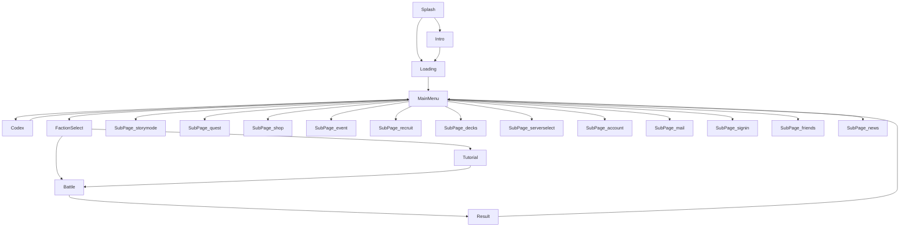

# 项目架构

> 本文档描述三国炉石 Demo 的整体架构、数据流与目录组织，便于新协作者建立宏观认知。

---

## 一、三层架构

```
┌──────────────────────────────────────────────────────────┐
│                    UI 层（屏幕组件）                       │
│   Splash / Loading / MainMenu / Codex / Battle / Result   │
│   FactionSelect / Tutorial / SubPage × 5                  │
│   - 仅订阅 store，无业务逻辑                              │
│   - 用 PNG 资源 + CSS Modules 渲染                        │
└──────────────────────────────────────────────────────────┘
                          ▲
                          │ subscribe / dispatch
                          ▼
┌──────────────────────────────────────────────────────────┐
│                  状态层（Zustand store）                  │
│   uiStore：currentScreen / showModal / introSeen / ...    │
│   gameStore：GameState 镜像 + 出牌 / 攻击 dispatch        │
│   - 单一可信状态源                                        │
│   - React 组件订阅触发重渲染                              │
└──────────────────────────────────────────────────────────┘
                          ▲
                          │ engine.playCard / engine.attack
                          ▼
┌──────────────────────────────────────────────────────────┐
│                  引擎层（GameEngine）                     │
│   engine/index.ts：可变状态机 + 伤害结算 + 回合切换       │
│   engine/ai.ts：启发式 AI 评分 + 出牌 + 攻击决策           │
│   engine/effects/actions.ts：法术与技能 action 注册表      │
│   engine/deck.ts：牌库 + 抽牌（含联动加权）               │
│   - 同步可变状态机，不抛业务异常                          │
│   - 直接修改 GameState 字段                               │
└──────────────────────────────────────────────────────────┘
```

---

## 二、屏幕导航流程



所有子页面均以 `btn_back.png` 古铜雕花牌作为统一返回入口，点击回到 MainMenu。

---

## 三、数据流

```
卡牌设计 JSON
   ├─ data/cards/shu.json       9 张
   ├─ data/cards/wu.json        30+ 张
   ├─ data/cards/neutral.json   中立卡
   └─ data/cards/weapons.json   兵器
              │
              ▼
data/cardLibrary.ts (查询接口)
              │
              ▼
engine/deck.ts (构造 CardInstance · 注入运行时状态)
              │
              ▼
GameState.player.deck / hand / board / graveyard
              │
              ▼
gameStore (Zustand) 镜像 + dispatch action
              │
              ▼
Battle / Card 组件订阅，按状态渲染 PNG 资源
```

资源加载通过 `data/assetLoader.ts` 借助 Vite `import.meta.glob` 将 `assets/ui/` 与 `assets/portraits/` 下所有 PNG 静态映射为 URL，避免运行时字符串拼路径。

---

## 四、目录结构

```
d:/三国炉石/
├─ docs/                              策划文档 + 模拟报告 + 审计
│  ├─ 09-三国炉石策划终稿-v5.md       策划终稿
│  ├─ AUDIT-2026-06-15.md             项目综合审计报告
│  ├─ ARCHITECTURE.md                  本文档
│  ├─ SECTIONS.md                      § 任务编号字典
│  ├─ HANDOFF-AI.md                    AI 协作专用接手指南
│  └─ sim-reports/                     模拟对局报告归档
│
├─ assetofsanguo/                     美术素材原始工作目录
│
├─ game/
│  ├─ package.json
│  ├─ vite.config.ts
│  ├─ tsconfig.json / tsconfig.app.json
│  ├─ eslint.config.js
│  ├─ index.html
│  ├─ PROGRESS.md                     项目进度档案
│  │
│  ├─ public/                          静态公开资源
│  │
│  ├─ scripts/sim/                     AI 对战模拟框架
│  │  ├─ seeded-random.ts              mulberry32 PRNG
│  │  ├─ simulator.ts                  单局执行器
│  │  ├─ stats-collector.ts            统计聚合
│  │  ├─ reporter.ts                   报告模板生成
│  │  ├─ analyzers/                    5 个分析维度
│  │  ├─ run-sims.ts                   CLI 入口
│  │  └─ trace-game.ts                 单局可视化决策追踪
│  │
│  └─ src/
│     ├─ App.tsx                       根：画布尺寸切换 + 路由
│     ├─ main.tsx                      ReactDOM 挂载入口
│     ├─ index.css                     全局 CSS + Google Fonts + 变量
│     │
│     ├─ store/
│     │  ├─ uiStore.ts                 UI 状态 store
│     │  └─ gameStore.ts               战斗状态 store
│     │
│     ├─ engine/
│     │  ├─ index.ts                   GameEngine 主入口
│     │  ├─ types.ts                   CardData / CardInstance / GameState 等
│     │  ├─ ai.ts                      启发式 AI 决策
│     │  ├─ deck.ts                    牌库构造与抽牌
│     │  ├─ events.ts                  日志条目辅助函数
│     │  └─ effects/
│     │     └─ actions.ts              法术与技能 action 注册表
│     │
│     ├─ data/
│     │  ├─ cards/                     卡牌 JSON
│     │  ├─ cardLibrary.ts             卡牌查询接口
│     │  └─ assetLoader.ts             import.meta.glob 资源映射
│     │
│     ├─ screens/
│     │  ├─ Splash / Intro / Loading
│     │  ├─ MainMenu
│     │  ├─ Codex
│     │  ├─ SubPage                   通用子页面（剧情 / 任务 / 商城 / 设置等）
│     │  ├─ FactionSelect
│     │  ├─ Tutorial
│     │  ├─ Battle                    战斗主屏（含拖拽、攻击、AI 触发）
│     │  └─ Result
│     │
│     ├─ components/
│     │  ├─ Card/                     卡牌渲染（按 rarity 加载边框）
│     │  ├─ Modal/                    全局弹窗
│     │  └─ CustomCursor/             §27 自定义鼠标光标
│     │
│     ├─ utils/
│     │  └─ canvasScale.ts             画布缩放单例
│     │
│     └─ assets/
│        ├─ ui/                       约 260 张 UI 资源（主体 PNG + Loading 背景 WebP）
│        ├─ portraits/                89 张立绘（WebP）
│        ├─ video/intro.mp4
│        └─ ASSETS.md                  资源清单
│
└─ .github/workflows/
   └─ deploy-pages.yml                 GitHub Pages 自动部署
```

---

## 五、关键设计约束

| 约束 | 说明 |
|:--|:--|
| 设计画布固定尺寸 | 横屏 1920×1080 / 竖屏 1080×1920，按当前屏切换 |
| 缩放策略 | CSS transform scale 等比缩放，多余空间填黑 letterbox |
| 屏幕组件尺寸 | 必须使用 100% 宽高，避免 vw / vh |
| 同步状态机 | GameEngine 方法直接改 state，UI 订阅触发重渲染 |
| 不抛业务异常 | 出牌失败等情况用返回值与日志反馈，不抛 Error |
| 单一可信状态源 | gameStore 镜像 GameState，UI 不缓存衍生值 |

---

## 六、扩展建议

新增卡牌：仅需向对应 `data/cards/*.json` 追加 JSON 条目，无需改动引擎。

新增 action：在 `engine/effects/actions.ts` 注册新函数到 `ACTIONS` 表，配合 `engine/index.ts` 的 `cardNeedsTarget` 与 `hasValidTargetsForCard` 同步维护。

新增屏幕：在 `screens/` 添加组件 + 在 `engine/types.ts` 的 `Screen` 类型补充字面量 + 在 `App.tsx` 路由分支挂载。

新增动画或特效：参照 §19.6 反馈系统的 Phase 划分，分阶段实施并 commit。
