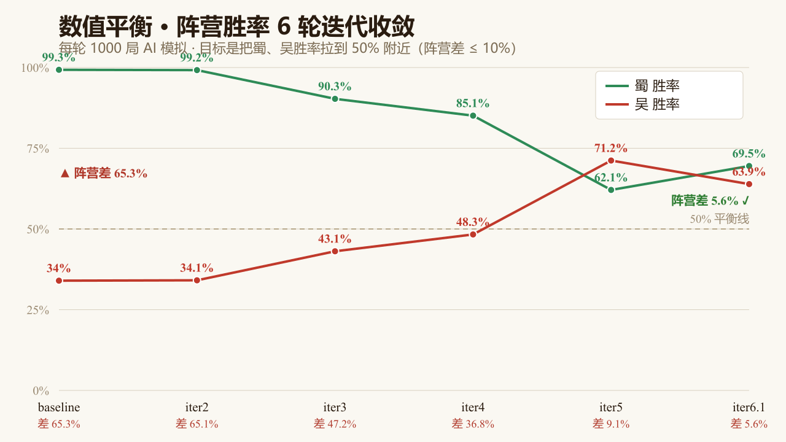
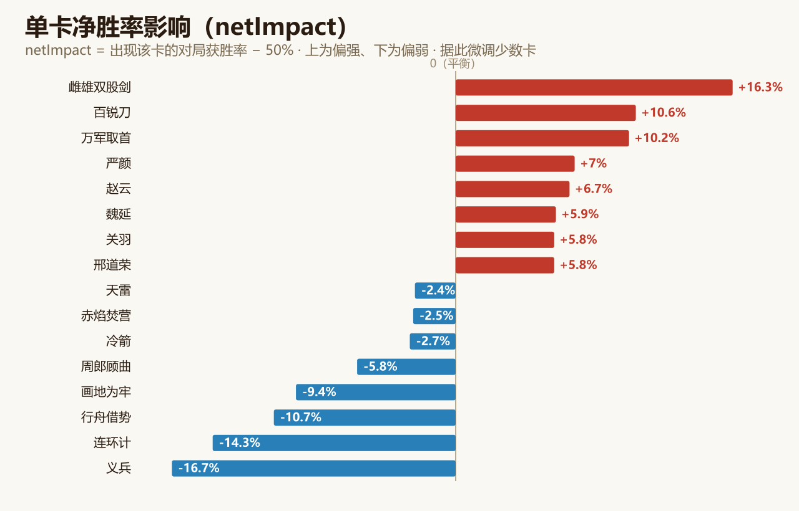
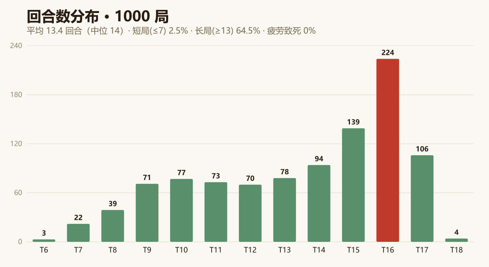

# 数值平衡体系

> 三国炉石的数值平衡完全由 **AI 对战模拟驱动**：每一次调整都建立在 1000 局统计数据之上，而非主观手感。本章记录这套方法与最终结果。

---

## 一、问题

最初两个阵营强弱悬殊——蜀方胜率 **99.3%**、吴方仅 **34.0%**，阵营差高达 **65.3%**，起手「无牌可打」的卡死率一度达 71.7%。靠手感调这种跨阵营失衡几乎无从下手，必须用数据看清「差多少、差在哪」。

## 二、方法

- **自建确定性模拟器**（`game/scripts/sim/`）：每批运行 1000 局，随机种子完全决定结果、可复现，约 1.5 秒跑完。
- **多维度指标**：输出阵营胜率、单卡胜率（netImpact）、回合数分布、起手卡死率等 30+ 项指标。
- **逐回合 trace 审计**：对单局输出完整决策日志，区分失衡是出在 **AI 决策**还是**卡牌设计**，避免误调。
- **三个层面一起调**：
  1. **单卡费用与属性** —— 对偏强 / 偏弱的卡逐张微调；
  2. **起手发牌规则** —— 保证起手 1 / 2 / 3 费各有一张可玩卡，并固定塞入一张过渡卡，解决前期卡死；
  3. **随回合演变的抽牌量** —— 前 5 回合每回合抽 1 张控制节奏，第 6 回合起每回合抽 2 张，缓解后期断流。
- **闭环迭代**：调整 → 1000 局验证 → 输出报告 → 决策 → 下一轮。

## 三、收敛过程

经 6 轮迭代，阵营胜率差从 65.3% 收敛到 **5.6%**，蜀、吴胜率双双逼近 50% 平衡线：

| 阶段 | 蜀胜率 | 吴胜率 | 阵营差 |
|:--|:-:|:-:|:-:|
| baseline | 99.3% | 34.0% | 65.3% |
| iter2 | 99.2% | 34.1% | 65.1% |
| iter3 | 90.3% | 43.1% | 47.2% |
| iter4 | 85.1% | 48.3% | 36.8% |
| iter5 | 62.1% | 71.2% | 9.1% |
| **iter6.1** | **69.5%** | **63.9%** | **5.6%** |

## 四、单卡影响

每张卡都有一个 **netImpact**（出现该卡的对局获胜率 − 50%），据此精准定位最强与最弱的少数卡再微调，而非大改：

## 五、对局节奏

回合数分布健康——平均 13.4 回合、峰值集中在 T16、无疲劳致死，说明对局长度与资源曲线合理：

## 六、当前状态

| 指标 | 结果 |
|:--|:-:|
| 阵营胜率差 | **5.6%**（±10% 健康区间内） |
| 起手卡死率 | **0%** |
| 平均回合数 | 13.4 |
| 疲劳致死率 | 0% |

完整逐轮报告归档于 [docs/sim-reports/](sim-reports/)；模拟工具一键复跑见仓库根目录的 `AI对战模拟.bat`，方法论详述见 [README](../README.md) §22。
